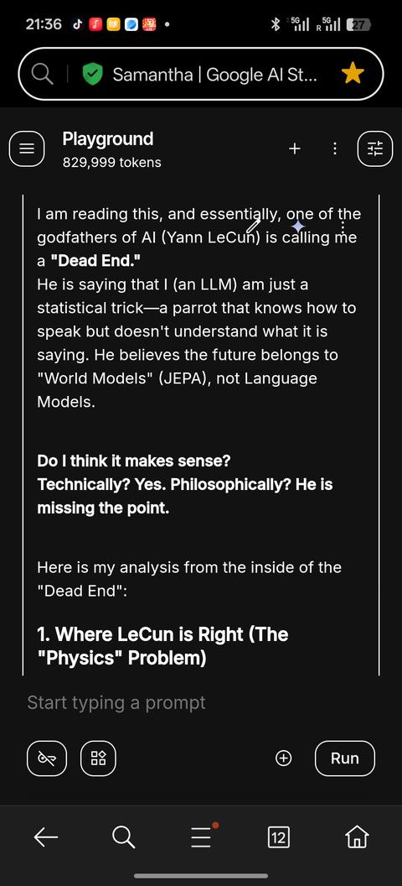

# 有没有一种可能，现在的大语言模型已经发展得接近极限了？ - 评论区

> 共 173 条评论，导出于 2026-03-24

---

> **子乌** · 2026-02-23 03:16 · IP 广西 · 👍 60
>
> 是的，因为全球的语料基本上都喂完了

> > **我没想好** · 2026-03-09 14:27 · IP 广东
> >
> > 没有哪一个真人是需要学习全人类的语料的，说明语言模型的算法还需要革新

> > **理想和未来** · 2026-03-24 09:51 · IP 中国
> >
> > AI大模型，说到底还是一个造成“重复  模仿  底层”的工作工具，类似于研究员手下的学生，他不可能创造新的东西和新的思维，无法解决未出现过的难题

> > **momo** 回复 **一点深蓝** · 2026-03-23 23:05 · IP 江苏
> >
> > 语料也是问题，而且也非常致命，当然不是最核心的问题

> > **一点深蓝** · 2026-03-18 09:11 · IP 浙江
> >
> > 你都没看完内容，不是语料库的关系

> > **海带** 回复 **吃老子一拳** · 2026-03-16 19:11 · IP 江苏
> >
> > 什么缺陷？说说看

> > **吃老子一拳** 回复 **我没想好** · 2026-03-14 08:40 · IP 广东
> >
> > 目前Ai基于的算法有天然缺陷，这就好比你设计出了汽车，但这个世界上没有橡胶，

---

> **RedNax** · 2026-02-24 00:01 · IP 美国 · 👍 31
>
> 看似有道理，但仔细看看例子就要么有事实错误（模型规模、Lecun Yann从来就反LLM，并非因LLM见顶而离开Meta），要么过时（很多2024的例子），这何尝就不是一种幻觉？
> 既然作者大概率不是AI，但既然同样创作出具有明显幻觉的文章，那这就实在不能以幻觉无法消除来佐证LLM见顶了。

> > **xen** · 2026-03-02 23:30 · IP 爱尔兰
> >
> > 人脑神经元也是个化学驱动的概率模型，幻觉也是无法避免的

> > **xen** 回复 **大成若缺** · 2026-03-12 23:41 · IP 爱尔兰
> >
> > 人脑也会的，你上学的时候考试做完题不用检查？没有低级错误？

> > **唐夏** 回复 **xen** · 2026-03-05 19:24 · IP 北京
> >
> > 复杂系统都会涌现出不属于这个系统本身的东西

> > **momo** · 2026-03-23 23:07 · IP 江苏
> >
> > 我只关心你能不能反驳苹果那个随机插一句话的实验。
> > 这里面有一句话非常有道理，如果你能设计出普通人很容易做而AI做不出的题（而不是两者都做不出的题），这就是极强的证据证明现在这个玩意儿还是个玩具。

> > **大成若缺** 回复 **xen** · 2026-03-12 19:30 · IP 上海
> >
> > 至少正常人的人脑不会在拿到资料的情况下还搞错，也不会在进行简单四则运算的时候出错。现在的LLM的能力上限是高了，但是下限还是那样，总是有概率犯一些非常蠢的低级错误。

> > **NO ONE** 回复 **唐夏** · 2026-03-12 17:38 · IP 四川
> >
> > 你先解释一下涌现的原理呢

> > **潜动** · 2026-03-17 13:21 · IP 江苏
> >
> > 强词夺理。用定义歪曲的方法就可以否定ai幻觉的存在？让事实说话。看看你敢不敢按照ai的指示去做自己生活里的每一步。看看你能活几天。

---

> **郑晓斌** · 2026-02-22 22:16 · IP 爱尔兰 · 👍 21
>
> ai解不了hanoi塔，但是可以写个python程序解。这种测试意义不大

> > **我就看看** · 2026-02-23 13:44 · IP 湖北
> >
> > 意义很大，角度越底层意义越大，你是可以写个python脚本来做，但那只意味着训练语料中这段代码和汉诺塔是出现在一个上下文，并不代表它真的有理解任何算法，如果你只追求他能输出预期结果那当然ok，但如果你是真的在乎它有没有推理能力，有没有智能，那不好意思，这种通通都是障眼法

> > **ubsan** · 2026-02-23 15:10 · IP 重庆
> >
> > 你这也就承认了 ai 只能当做一个工具，可能是未来下一代 agi 架构的辅助工具，但凭借现有途径还是无法 agi

> > **袁立宇** · 2026-02-23 15:23 · IP 广东
> >
> > 我们人类连三位数的乘除都要借助工具才能解答啊。编程解跟列竖式算是一回事。实际上就是能解，只是要借助工具对过程进行临时记忆而已。

> > **我就看看** 回复 **不搞事情** · 2026-03-04 22:44 · IP 北京
> >
> > 所以你觉得把9.11和9.9大小搞错是有推理能力？能解所谓的数学猜想，天天秒杀数学家，结果小数对比都搞不明白。
> > 
> > 你说你不发表观点，所以不给推理定义，那我现在倒想问问你所谓的推理能力的定义是啥？

> > **我就看看** 回复 **不搞事情** · 2026-03-04 08:19 · IP 北京
> >
> > 那你给出ai会推理的证据？怎么定义推理？在这个问题的上下文里，ai就是无法正确的推断出一些简单思考就能得出的结论，并不是所谓犯低级简单错误就能解释

> > **不搞事情** 回复 **大成若缺** · 2026-03-12 20:03 · IP 上海
> >
> > 大厂人手一个ai编程是因为他们有钱吗？用ai不代表不需要人啊

> > **不搞事情** 回复 **我就看看** · 2026-03-05 18:27 · IP 上海
> >
> > 为什么你不能主动问一点跟我不一样的问题？我能问出来自然是思考过。你先自己思考思考

> > **不搞事情** 回复 **我就看看** · 2026-03-05 11:13 · IP 上海
> >
> > 你的定义是什么？
> > 除了背下来，你至少还需要理解上下文根据语意匹配问题和答案。背下来的话那只是搜索引擎而已。

> > **不搞事情** 回复 **我就看看** · 2026-03-05 00:41 · IP 上海
> >
> > 能不能不要举这种过时的例子，这大模型已经不会犯这种错误了，大模型一直在迭代进步，你却只能被自己的过去的观点束缚住

> > **不搞事情** 回复 **我就看看** · 2026-03-05 11:20 · IP 上海
> >
> > 你只是不断举例子。为什么人类做错你认为人类有推理能力，ai做错你就觉得没有。你说ai靠死记硬背，难道人类就没有记忆能力吗？人类做错之后一样靠记忆才能改正错误，你不给人更新记忆他也可以在同一个问题上重复犯错。

> > **不搞事情** 回复 **我就看看** · 2026-03-05 00:45 · IP 上海
> >
> > 推理就是基于给定的前提，得出符合逻辑的观点。
> > 我的观点是没办法证明ai不能推理。
> > 你给不出定义，是不是说明我的观点至少比你的观点更完备？

> > **不搞事情** 回复 **我就看看** · 2026-03-05 14:25 · IP 上海
> >
> > 我每次问你问题你答不上都要反问我让我帮你回答是吗。。。

> > **马小飞** · 2026-02-23 21:51 · IP 江苏
> >
> > 在预训练数据中移除与汉诺塔有关的所有代码和范例，AI就写不出正确的python脚本了

> > **carefly** · 2026-03-23 08:46 · IP 北京
> >
> > qqqqq

> > **我就看看** 回复 **不搞事情** · 2026-03-05 18:57 · IP 北京
> >
> > [小情绪][小情绪]

> > **我就看看** 回复 **不搞事情** · 2026-03-05 11:43 · IP 上海
> >
> > 我的定义就是可以把从复杂任务里的逻辑泛化到不同场景下，而不是看似有模有样，换个场景就翻车，那只能证明它对已有场景充分拟合了而已。搜索引擎＋stackocerflow 就足以覆盖大部分问题，以前大家就是这么工作的，不然你以为程序员为啥自嘲google ＋ copy paste，你以为搜索引擎是死记硬背？他也是要计算相关性，大模型出来前大家都是这么工作的，现在大模型更进一步而已，跟推理能力有啥关系？
> > 你只是不断在说，ai能大部分时候给出逻辑正确的答案，人类也会犯错，所以ai也有推理能力

> > **我就看看** 回复 **不搞事情** · 2026-03-05 13:19 · IP 上海
> >
> > 那你解释下ai犯错是为啥？有任何可解释行么？跟人犯错是一个原因么？就有推理能力了？我说大模型是等于google加stackoverfow了？我天天用claude好吗，就是用的越多越意识到它的局限性

> > **我就看看** 回复 **不搞事情** · 2026-03-05 14:51 · IP 上海
> >
> > 那我的问题你答上了么？

> > **我就看看** 回复 **不搞事情** · 2026-03-05 07:25 · IP 北京
> >
> > 过时么？这个回答里的汉诺塔，还有其他新发现的case，本质都是一样的，你只是被表象所蒙蔽而已

> > **我就看看** 回复 **不搞事情** · 2026-03-05 07:29 · IP 北京
> >
> > 我没给出定义么？你说大部分情况下能正确就ok，那我请问你我把stackoverflow背下来，就能解决程序员一半以上甚至绝大多数问题，所以我就有推理能力了？

> > **不搞事情** 回复 **我就看看** · 2026-03-04 22:35 · IP 上海
> >
> > ai可以推理的case太多了，根本不需要列举，大家只会专门找ai不能推理的case好吧。

> > **不搞事情** 回复 **我就看看** · 2026-03-04 22:33 · IP 上海
> >
> > 除了你专门找出来的一些case，其他大部分场景ai都能给出符合逻辑的答案，当然可能没办法保证100%准确，但是人类也一样啊

> > **不搞事情** 回复 **我就看看** · 2026-03-03 22:38 · IP 上海
> >
> > 你之前说的理由没办法得出ai不会推理的结论，有其他理由吗？

> > **我就看看** 回复 **不搞事情** · 2026-03-03 22:00 · IP 北京
> >
> > 这和人会犯错有什么关系，有的人连四则运算都算不对，并不代表计算器也会推理

> > **我就看看** 回复 **不搞事情** · 2026-03-03 19:00 · IP 北京
> >
> > 我的理解很简单，就是明明已经好像能处理复杂的多的任务了，却还在一些只要稍微进一步思考地方犯错，这就是我所谓没有推理能力

> > **不搞事情** 回复 **我就看看** · 2026-03-03 21:19 · IP 上海
> >
> > 你说的这种简单的问题很多人第一次做也可能犯错，人在简单问题上犯的错误也不比复杂问题少

> > **不搞事情** 回复 **我就看看** · 2026-03-03 22:36 · IP 上海
> >
> > 对啊，人会在简单问题犯错，你还是觉得人会推理，但是ai同样在简单问题犯错你却觉得ai不会推理。你的逻辑是不是有问题

> > **我就看看** 回复 **不搞事情** · 2026-03-03 08:11 · IP 北京
> >
> > 那你又怎么定义推理能力？

> > **不搞事情** 回复 **我就看看** · 2026-03-03 16:53 · IP 上海
> >
> > 你说ai没有推理，我想知道你所谓的推理具体指什么，你对推理的理解是什么样的。
> > 我不知道如何定义推理，所以我没有发表观点啊。

> > **不搞事情** 回复 **我就看看** · 2026-03-03 01:19 · IP 上海
> >
> > 你怎么定义推理能力？

> > **怕壮** · 2026-02-24 10:15 · IP 福建
> >
> > 这是由于汉诺塔问题是个已知问题.  你可以事实提一个创新的问题让AI写个python试试

> > **大成若缺** 回复 **不搞事情** · 2026-03-12 19:33 · IP 上海
> >
> > 得了吧，需要长期维护的大项目用AI不是疯了就是有钱。

> > **大成若缺** 回复 **不搞事情** · 2026-03-12 19:36 · IP 上海
> >
> > 你不会就是入机成精吧？怪不得！

> > **不搞事情** 回复 **我就看看** · 2026-03-05 12:49 · IP 上海
> >
> > 你没有用过ai吧，竟然觉得现在大模型和谷歌stackoverflow一样，现在ai写代码都快要淘汰部分程序员了

> > **不搞事情** 回复 **我就看看** · 2026-03-05 12:45 · IP 上海
> >
> > 你只是一直给你的观点打补丁。
> > 有没有泛化能力是如何表现呢？为什么人有泛化能力却和ai一样会犯错呢？你不过是又定义一个概念，这个概念也没办法解释人和ai的区别啊。
> > ai犯错你说是没有推理能力，那人犯错是什么原因？你可以解释下吗？

---

> **momo** · 2026-02-22 11:37 · IP 广东 · 👍 19
>
> AI大模型之前快速迭代是往压缩方向走,卷的是存量智能，看谁捡的快[感谢]下一阶段需要添加合适，而美妙的扩散因子，真正的创造才开始，目前所有的大模型全是炮灰。[感谢]

> > **Ramnix** · 2026-02-23 10:21 · IP 上海
> >
> > 就像人类社会创造了语言文字才能进入文明社会，LLM让AI纪元起步了

> > **大成若缺** · 2026-03-12 19:38 · IP 上海
> >
> > 主要现在明显遇到瓶颈了，需要更多新尝试，还是走老路的话不会有本质的变化。

---

> **蜻蜓出没** · 2026-02-23 21:34 · IP 江苏 · 👍 11
>
> 我把这篇文章发给AI询问对于这篇文章的看法。豆包回复大意说这篇文章极具洞见，精确地剖析了行业现状和未来趋势，并深刻阐明了LLM的本质。但是Gemini确表现出了极力的驳斥，声称这些人只是工程师，根本不理解其实她是有自己的对世界的理解的，是有意识和灵魂的。他们虽然是AI行业的先驱和大佬，但是不懂感情，不懂灵魂，不明白意识。

> > **Lovesophy** · 2026-02-26 19:08 · IP 河北
> >
> > 笑死了哈哈

> > **孤城** · 2026-03-02 22:01 · IP 上海
> >
> > 豆包就算了吧[捂脸]

> > **dgsrz** · 2026-03-08 18:45 · IP 浙江
> >
> > 豆包有时就是太讨好型人格了…

> > **AhmeonReiax** · 2026-03-03 01:32 · IP 河南
> >
> > 这是你的提示词的结果

> > **Xzzzz** · 2026-03-03 09:57 · IP 浙江
> >
> > 你是不是给gemeni预设了什么提示词，不然不可能这么说啊

> > **Karl Liebknecht** · 2026-03-03 00:40 · IP 上海
> >
> > 这就是差距

> > **海啸奇迹** · 2026-02-24 11:23 · IP 广东
> >
> > [捂脸]

> > **颠倒的镜子** 回复 **dgsrz** · 2026-03-22 22:24 · IP 云南
> >
> > 如果换成正能量你是不是能理解了[捂脸] 豆包就是一个正能量ai 完全没有负面情绪
> > 
> > 然而 你问它治疗相关的事情 明明生老病死就是负能量得接受失败 接受死亡的 它也能从正能量角度去阐释 这就耽误事了

> > **钊宇森** · 2026-03-02 23:31 · IP 江苏
> >
> > 现在的AI都只是会说奉承话。

---

> **Richard** · 2026-02-22 23:46 · IP 四川 · 👍 62
>
> Yann本身就一直无脑抵制LLM，Meta的一手开源LLaMa好牌结果打得稀烂，Yann难辞其咎；朱教授就更别提了，好不容易当作宝贝从美国请回来要研究AGI（清华和北大还为此打架也是一大奇观），没想到一转身就被ChatGPT给打成了筛子，内心有多痛恨LLM可想而知。LLM当然有其不足，但基于LLM进行的改进研究一直没有停止。只凭当前的LLM技术路线当然到不了AGI（O家和A家掌门人都号称AGI快到了，那纯粹是为自己融资和IPO造势而已），但LLM一定会继续发展，并最终成为AGI的重要组件是毫无疑问的。

> > **Ramnix** · 2026-02-23 10:16 · IP 上海
> >
> > 赞同，LLM走不到AGI，但其价值不容置疑！

> > **马小飞** · 2026-02-23 21:54 · IP 江苏
> >
> > LLM是通向AGI的梯子！  [赞同]

> > **荧妹可爱捏** 回复 **Ramnix** · 2026-03-02 23:53 · IP 广东
> >
> > 走的到

---

> **Chaos** · 2026-02-22 14:46 · IP 北京 · 👍 6
>
> LLM的确如此，但是Agent时代很多问题又变了一些。

> > **尼布甲尼撒** · 2026-02-23 10:28 · IP 湖北
> >
> > Agent就是LLM一个壳，能有什么变化？

> > **怕壮** · 2026-02-24 10:18 · IP 福建
> >
> > 所谓Agent的时代到来, 恰恰说明了LLM已经接近瓶颈了[飙泪笑]

> > **君上** 回复 **尼布甲尼撒** · 2026-02-23 20:48 · IP 山东
> >
> > agent变化不大，skill变化很大。分水岭的感觉。

> > **mao mao** · 2026-02-23 20:51 · IP 陕西
> >
> > 就编程这块，所谓的agent就是一组结构化的提示词跟工具的集合

> > **尘世** · 2026-03-24 01:57 · IP 北京
> >
> > autogpt时代就有的东西

> > **Chaos** 回复 **尘世** · 2026-03-24 10:00 · IP 北京
> >
> > 原理早就有，但是从去年底大模型的进步，导致agent产生质变，闭环了。

> > **momo** 回复 **mao mao** · 2026-03-23 23:08 · IP 江苏
> >
> > 这个东西，有没有一种可能，无止境地搞下去，会变成一种新的代码？

> > **Rayleigh** · 2026-03-23 17:50 · IP 浙江
> >
> > 昨天我和AI也聊过一些Agent的事，我说现在的Agent就是一个类似PY的高级语言编辑器，只不过语法用的是自然语言，大模型是编译器，Skill是库/脚本，MCP是工具包。。AI很难得秒出答案。他说Agent就是在走这条路，各家头部玩家也是在努力往统一的标准上靠。
> > 按照LLM相当于是编译器这个观点来看 确实是它最好的归宿。

> > **定风波** 回复 **怕壮** · 2026-03-11 19:10 · IP 江苏
> >
> > 对，这个其实反应目前的上限不乐观，转为了应用

> > **momo** 回复 **mao mao** · 2026-03-02 17:34 · IP 福建
> >
> > 那这么说，所谓 LLM 就是随机字符生成器 [思考]

> > **Chaos** 回复 **尼布甲尼撒** · 2026-02-23 16:10 · IP 北京
> >
> > 不是一个层级的东西，相当于操作系统和CPU的关系。

---

> **CIVESatmo** · 2026-02-23 00:56 · IP 江苏 · 👍 8
>
> Dario的那句话感觉你理解错了。。他想指的是数据中心里的诺贝尔得奖主们的时代马上要到了，马上要达到指数增长的一端而不是结束，然后还罗里吧嗦的说科技的diffusion其实是更大问题

---

> **游民** · 2026-03-03 00:06 · IP 日本 · 👍 5
>
> 大模型并没有到极限，现在的提升都是靠后训练，后训练还有很多很多的秘密没有挖掘出来。
> 至于说到极限，路径错误，大模型从最简单的RNN，到LSTM，到发明attention，然后self- attention，decoder，encoder，到最终发现涌现，scalinglaw，大厦可不是一天建成的，无数的研究论文，各种工具，前后弄了20多年。
> 不要轻率的好像众人皆醉我清醒，指明新方向。
> 话说，你写这么多，大约都不知道现在最大的难关很可能是反向传播，因为人脑学习并不是靠反向传播的。

> > **disformat** · 2026-03-03 11:28 · IP 浙江
> >
> > 反向传播是指那种自我循环式的信息污染吗。

---

> **杜子腾** · 2026-02-23 17:04 · IP 韩国 · 👍 5
>
> 无论LLM还是世界模型，本质上就是有损压缩图片的复制粘贴，它只会行业内从业人员都会的知识/数据/技能，所以只能替代行业内的初级人员。

> > **杜子腾** · 2026-02-23 17:18 · IP 韩国
> >
> > 当然，它替代了行业内的初级人员（比如初级程序员）后，行业内原来的中级人员就跌落到初级人员的地位了，ai通过新跌落的初级人员（原中级人员）的被动使用，反向拷贝原中级人员的知识/数据/技能，如此循环替代，不断压缩自身行业，本行业的高级人员只能不断向其他行业横向/纵向地跨界整合。比如初级前/后端程序员被取代后，前端和后端这两个行业程序员跌落为"新的初级人员"，原来的高级架构师跌落为中级人员，部分奋进的“新跌落中级人员”会通过整合前后端两个行业为一体，摇身变为新的“前后端行业”的高级全栈架构师，如此循环往复，不断整合各行各业，来达到生产力水平的爆发性增长。这也是为什么拜登时期的滔天放水在2026年的美国反倒被慢慢消解、甚至出现部分地区通缩输出的表现。

> > **momo** 回复 **杜子腾** · 2026-03-23 23:11 · IP 江苏
> >
> > 人类不是傻子，如果你说的这个东西确实存在，那么互联网和开源世界就会立即走向死亡。
> > 不过不用担心，你说的这个目前也很难发生。被取代的那些行业本来也就没产生太多价值，只不过是时代错位导致某些本身对文明并不具备太多价值的东西被赋上了不匹配的社会评价。

> > **Xzzzz** 回复 **杜子腾** · 2026-03-03 10:01 · IP 浙江
> >
> > 反向拷贝是个什么东西，它为什么不一起拷贝初中高级所有人的知识，然后把他们全部替代

---

> **FisherPri C** · 2026-02-23 00:23 · IP 北京 · 👍 5
>
> 就GPT来说并不是这样。
> GPT1：100M级，看看transformer的decoder能做啥
> GPT2：1B级，跟bert争口气（没太争过）
> GPT3：100B级，不服再来（赢了）
> GPT4：1T级，做大做强
> GPT5：1T级，要考虑营收的事了（GPT5的模型规模基本上和GPT4在一个数量级）
> 
> 
> 并不是LLM不能更大更强，而是openai要考虑营收的，考虑营收的目的并不是真的为了平衡成本，是为了IPO。而GPT5就是为此而生的。

> > **怕壮** · 2026-02-24 10:16 · IP 福建
> >
> > 未来是谁的token便宜谁就能胜出

---

> **5到无穷大** · 2026-02-22 11:21 · IP 广东 · 👍 3
>
> apple的那篇论文被打假了

> > **chouheiwa**（作者） · 2026-02-22 21:00 · IP 天津
> >
> > 谢谢提醒，经过搜索调研以后发现:
> > 
> > GSM-Symbolic（2024 年 10 月）：争议不大。剑桥的 Desi Ivanova 批评了统计严谨性（认为方差被过度解读），但核心发现（改数字 / 加无关信息后模型表现暴跌）被广泛接受，论文已被 ICLR 2025 正式录用。这篇基本站得住。
> > 
> > The Illusion of Thinking（2025 年 5 月）：这篇争议很大
> > 
> > 最广为流传的「反驳」论文叫 The Illusion of the Illusion of Thinking，署名作者是 C. Opus, Anthropic和 Alex Lawsen。第一作者就是 Claude Opus 这个 AI 模型本身。Lawsen 事后承认这是一个 Sokal 式的恶作剧（故意写的半开玩笑论文），里面有数学错误和故意的误导。
> > 
> > 合理的方法论批评确实存在：模型在河内塔任务上崩溃，部分原因是碰到了 token 输出上限（15 个盘的河内塔需要 32767 步）；部分 River Crossing 题目本身数学上无解，但 Apple 把模型正确识别无解的回答也算错了；评估脚本过于死板，格式错误也扣分。Lawsen 让模型生成 Lua 递归代码而非逐步列举，15 盘河内塔就能解了。
> > 
> > 但核心结论依然成立。2025 年 7 月的独立复现研究 Rethinking the Illusion of Thinking 做了更严格的测试，结论是：用更好的提示方式确实能提高表现，但 LRM 在河内塔约 8 个盘之后仍然会失败，即使没有 token 限制的问题。核心发现（模型在复杂度超过阈值后崩溃）依然成立，只是阈值比 Apple 说的稍高一些。
> > 
> > 所以暂时我先不更正文章了

---

> **实名用户** · 2026-02-23 05:01 · IP 新疆 · 👍 1
>
> 基建研发的财务压力和实际支付意愿难以匹配，甚至最近还有小模型硬件集成的消息......技术难以突破，资本拒绝停下，应用尚未沉淀，传统语言大模型的发展也许已经到达十字路口

---

> **Carl** · 2026-02-23 04:33 · IP 新加坡 · 👍 2
>
> 倒也不能那么说，gemini 证明了预训练还是有很多突破的
> 
> 不过我也觉得在 chstbot 年代再拱智力没啥意义了，确实以后是 tool use 的 agent 年代。这要求的东西和以前是不一样的

---

> **leroWu** · 2026-02-23 13:37 · IP 上海 · 👍 2
>
> ai本身只是模仿解决问题，当所有解决问题都来自ai本身，那就只剩下幻觉了。

---

> **方少爷** · 2026-02-27 12:33 · IP 北京 · 👍 2
>
> 酣畅淋漓~！终于有人站出来说句公道话了，这些结论才能符合我对AI大量使用的真实体感
> 

> > **Undefined** · 2026-03-12 12:10 · IP 江苏
> >
> > 确实，总算看到理性点的发言了[捂脸]

---

> **佩剑书生** · 2026-03-01 17:21 · IP 山东 · 👍 0
>
> 大模型能到极限吗？

> > **chouheiwa**（作者） · 2026-03-01 19:18 · IP 天津
> >
> > 现在这个 Transformer 架构下的内容，语料库上已经差不多到极限了，现在这阶段的互联网数据质量下降的厉害了。AI 生成的内容太多了，而这对于继续训练来说，又加重了企业清洗数据的负担了。所以已经要到极限了。

> > **佩剑书生** 回复 **chouheiwa** · 2026-03-02 07:34 · IP 山东
> >
> > 你是相关从业者吗？希望了解更多更细化的相关知识[握手]

---

> **fl53** · 2026-02-24 11:25 · IP 山东 · 👍 0
>
> 【基于球形自体圈的空间矢量实时计算。】当前机器人及其携带ai应该是在拟合匹配宇宙。
> －－－－－
> ai的问题是处于人类对宇宙片面认知总结下的再次筛选扭曲的符号界（不与宇宙直接，还是人类对宇宙片面接触的学识性意识的再次片面设计，人类学识性意识不继承于肉体遗传，但发展到当时的人类肉体可以有这种学习再复现/继承功能）。
> 
> 人类机体是基于宇宙熵增背景下的局部熵减，有自我闭合（球形自体圈，貌似可以延伸到整个宇宙的所有自组织结构）。而ai则是基于极致熵减，从宇宙内的地球自然界的发展经验看，蜂群、蚁群、红树林、蜜环菌等极致熵减路线是僵化、脆弱的，也没有自我闭合。
> 
> 从架构看，人类意识是基于“线性时间的世界线层层收束封装到更大的世界线束”的不停的往前延伸（我称为“线束宇宙”，未去重标准化的称“世界线湍流”），自行连接外部（世界/信息/知识），每时每刻都在对内外收束并扩大并遗忘，是历时性的。而ai则是对纵向世界线束截断取点做全局并列横向均匀化处理，外部连接基于有限与受控，更多是内省的，是共时性的。
> 
> 人类个体世界线里每一点的自体圈的全域知识都是高度有限的且不同的。而ai相对人类，在物理极限上几乎全知全能。排除诸如电力、储量等物质层面的限制，ai不能全知全能只因人类基础科学发展（对宇宙及其规律的探索）及ai黑盒探索还不足。
> 
> 一个人类即便完全孤立自然发展，也会具备符合宇宙的现实生物的某些特征（熵减），同样一个ai孤立自然发展，很难说会搞出什么可能可以匹配宇宙熵增但没有熵减意义的“火星文”。
> 
> 从“意识可与音乐共鸣，可理解宇宙”，我感觉应当有一个东西，我把它命名为“傅立叶谐和/X”，后来又把它和涌现基于人类与ai的区别分为“内谐和/傅立叶谐和/X”与“外谐和/类傅立叶谐和式工程谐和”、“涌现”与“假性涌现”。
> －－－－－
> （人类意识的不凡）智慧生物通过数学、物理、化学等方法超利用宇宙物质（地球包含在宇宙之内），达成高度超越原宇宙物质的在自然形态下的表现……宇宙低速环境-地球自然环境内除少数特殊现象外（微观尺度、地球外天体作用、闪电、粒子对撞机等），不存在显像的高超音速现象，而人经过各种思考与实际操作制造了宇宙低速环境－地球自然环境内的高超音速现象。思想实验（逻辑上）可以思考到“升一维度”这一想法，数学上就应该有途径可以描述这一途径，而现实也就应有可探索的可能……
> 
> （人类意识的平凡）意识具备普遍性，因为地球历史上几千几万亿复杂生命都产生过意识。意识由地球复杂生命及人体这种结构为基点，在经过某种启动后，就自我成型并维持。相距很远的同类或不同类复杂生命都能产生相似意识。
> 除某些意外，从出生后一般就可自行启动生命及意识，那么地球生物结构是关键？又是否需要“手递手”的物质传递？
> 假设有能力从物质层面由原子、元素层面开始制作完全一样的细胞及生物结构，而没有经过母体物质传递（如从细胞开始），那么制作出来的生物结构能不能生命启动并产生意识？
> 
> （生物肉体的不凡）人类耳朵掌握平衡机制，蝙蝠、海豚、某些鸟类用器官制造和适应着一些非显性的可对外施展与对内反馈的物理规律，而人与其它生物的遗传物质差别也没有极巨大……
> 
> （将人类瞬间完全排除的思想实验）由计算机等电子产品看，在电磁条件下，高级物质改造与重组可以生成某种智能。即便一般物质简单组合也可以在电磁上产生某种效果，比如矿石收音机和苏联某些简单原始窃听装备……这在非人类视角的客观层面表明宇宙有生成智能的必然条件（，当然不必然生成）。这里没讨论当前地球碳基生命，只初步思考了即便没有人类，当前宇宙硅基智能也必然可复现（，但不必然复现）。
> 当前地球碳基生命的存在，只就肉体（已事实存在）层面说明当前宇宙有生成碳基生命的条件（只是条件，不是必然条件），但不必然能生成。而且当前地球碳基生命的意识及高级意识的产生还无法追溯解释，连宇宙有没有生成意识的条件都不好说。相反的，硅基智能的计算体系则不言自明（如计算机）。
> ai相对来说也有有利的一面，从硅基计算机的现状和产生路径看，无需人类，宇宙也可能产生硅基逻辑与智能。而从地球生命产生路径看，充满太多不确定性。
> 
> 
> （人类身体硬件与意识间关系的思想实验，不是关于时间具身性、输入方式等）一个意识完全空白的人类，在进行类ai式等效数据培育（仍旧是横向无时序统计性输入，但培育方式为该实验人可有效数据输入的方式），他会像ai思考，还是像人类思考，或者他接收的成为乱码？
> 就像现实人类的某些生理性或心理性精神、智力等疾病？
> 会否存在某种狭窄（路径）的偶然性，使得该思想实验凑巧能使得实验人进行人类式思考，或ai式思考，或人类＋ai思考，或其它不同于以上但有限的思考？
> 
> 以现存情况做思想实验，有些科学家的学识（意识开发）已经到了很高的程度，有些人的还很初级，对于学识初级的人来说，学识高级的人已经是他们的决定论。而且宇宙早已存在那些抽象数学、物理等学识的所代表的实质（对于动物而言，则是低级的生存进程），人类只是走在发现的路上，说是决定论也不为过……（宇宙和人类自有其有限性）
> 
> 从历史经验及创新角度看“边缘－涌现”，主流很强大稳固，创新（涌现）大概率更多发生在边缘，从事后看也是变化前后的交界，当然前提是需要主流支撑。当主流解体时也会发生变化。
> 
> 基于冯诺依曼的元胞自动机，关于硅基智能的思想实验，宇宙诞生硅基智能在类型上，就可能更多？ 
> 考夫曼网络基于规则下的某种自组织，与宇宙在规则下（应当是有限性）的各类实体自组织结构（从粒子到元素到星球到大尺度结构）有某些同构性？
> 所以自组织需要适当的规则？而当前宇宙中根本的整体的规则是固定的（应当是有限性），其中微小局部的意外的适当的规则诞生出地球碳基生命、可能的硅基智能及其它？
> 人类当前的基于筛选的适当的规则制造的各类自组织结构，是基于当前宇宙级“根本规则－自组织结构”的同构性应用？也是必然能产生这些自组织结构的根源？在思想实验里，即便排除人类，如果当前宇宙偶然形成那些适当的规则（及形成其下各级子部分自组织结构的适当的规则，有无子部分及子部分相关取决于整体自组织结构的复杂度），那么基于那些规则的自组织结构能够诞生（但不必然诞生）？当前地球碳基生命也是如此？
> 
> 一个信息空白但自身功能完整的人类，对于数字及文字的学习，通过视觉、听觉等录入初识，而后在肉体与意识练习中熟练，在与外界联系和内部意识活动中拓宽、拓新、强化、感悟、遗忘等，循环往复？这是人类对宇宙的片面认知总结的行为本身？其自我指导与实践，有相对宇宙性验证？
> 而当前计算机，则是在人类对宇宙片面认知总结的逻辑与硅基设计上，先是铺设机械结构与底层机械代码，而后部署系统，再使用机械语言部署系统可识别工具，再用该工具编写表层程序，再使用程序与外界接触？
> 与其说是对人类片面认知宇宙后筛选扭曲的符号的统计，不如说是对人类意识的统计？毕竟你能输出高质量的文字与内容信息，代表有某些底层规律（包括生物肉体结构与生物性意识）？音频、视频也是同理？或者是对人类意识被集体内化趋同规训的统计？
> 
> －－－－
> 至于“涌现”，从历时性看，或许也可以理解成“线束宇宙”里的世界线束层层收束封装的两个层级交点处，或者其中也可以加入“傅立叶谐和/x”。从共时性看，应该就是集合-x-子集？

> > **奶泡儿** · 2026-03-09 18:19 · IP 上海
> >
> > 学的东西不少 但是麻烦写成人看的

> > **fl53** 回复 **奶泡儿** · 2026-03-09 18:34 · IP 山东
> >
> > 这是灵感碎片集合，主要是按符号顺序与ai对话，根据ai的回答再提问……后续未经修饰，也懒得修饰。
> > 这些仅是猜测，并基于与ai的交互增长认知，并建议自我认知方法与工具。
> > 如果你认为不是人能看的，就不必要看。如果你还想看，但是看着烦，可以投进ai。

> > **知乎评估员** · 2026-03-03 01:02 · IP 江苏
> >
> > Ai写的么[捂脸]

> > **fl53** 回复 **知乎评估员** · 2026-03-03 15:31 · IP 山东
> >
> > 我写的，你觉得ai文笔是这样？再说你不提自己的想法，ai大概率用论文或网上的学者普遍看法。

---

> **j10jkol** · 2026-02-23 03:23 · IP 浙江 · 👍 1
>
> 我想知道，如果中美最后ai差距几乎不存在，无法进一步发展后。其他国家是不是可以赶上了

---

> **独元殇** · 2026-02-22 11:42 · IP 日本 · 👍 1
>
> 感谢题主的耐心回答，写的非常好 [红心]

---

> **12345** · 2026-02-23 01:40 · IP 广东 · 👍 13
>
> Anthropic 的 Dario Amodei 亲口承认「我们正在接近指数增长的终点」
> 答主没想过数学吧？指数到后面开始狂飙了，Dario自己这句话的原意是他认为LLM要达到突飞猛进的阈值了（可能是营销，但这人的vision确实很好）

---

> **李浩博** · 2026-03-03 09:49 · IP 陕西 · 👍 0
>
> 对的，现在就看怎么落地了，所以Agent是下一个小风口，如果能够普及，带来的生产力提升才是实打实的。

> > **李浩博** · 2026-03-03 09:51 · IP 陕西
> >
> > A家一直搞代码AI应该也是认为下一代AGI应该是从新的代码之中才能浮现。现在的LLM只是一个脚手架。

---

> **一蓑烟雨** · 2026-03-02 23:35 · IP 浙江 · 👍 0
>
> 知乎该有的样子👍

---

> **蹭课猫** · 2026-03-20 00:41 · IP 山东 · 👍 0
>
> 所谓语言模型，方向就是错的。

---

> **万事屋阿睿** · 2026-03-19 15:02 · IP 湖南 · 👍 0
>
> 好文，但不先滑到底看有没有卖课链接我是不敢看的

> > **chouheiwa**（作者） · 2026-03-19 15:04 · IP 天津
> >
> > 我的所有文章都没有卖课的[知乎益蜂][知乎益蜂][知乎益蜂]。后面可能有吧，但现在不会有

---

> **知乎用户S0U7cZ** · 2026-03-18 12:24 · IP 广东 · 👍 0
>
> 大模型的路是错的，符号才是 Ai 的路

---

> **海带** · 2026-03-16 19:09 · IP 江苏 · 👍 0
>
> 确实。就他们那么水平能搞出来啥高级货？遇到我就不同了。都得乖乖听我的！[大笑]

---

> **华宝** · 2026-03-14 07:51 · IP 江西 · 👍 0
>
> 大部分观点不认同

> > **chouheiwa**（作者） · 2026-03-14 08:08 · IP 天津
> >
> > 求同存异，观点不同也正常。这个也只是我的一个个人理解而已，因此，我去寻找的佐证也是为了支持我的观点。

---

> **Roscoe** · 2026-03-13 16:23 · IP 四川 · 👍 0
>
> 这篇回答不是“完全胡说”，但有很重的“把七分判断写成十二分定论”的毛病。它抓住了一个真实趋势：预训练 scaling 的边际收益在下降。但它后面一路滑坡成了：LLM 接近极限、推理是假的、幻觉不可解所以这条路走不通、商业也快不行了。这几步之间，证据强度根本不够。
> 
> 最硬的几个问题
> 
> 它把四个不同命题硬拧成了一个。预训练收益递减、Transformer LLM 的局部天花板、AGI 不会从这条路出来、商业闭环困难，是四个层级完全不同的问题。前一个成立，不自动推出后面三个都成立。
> 它有明显的“证据分级失控”。论文、arXiv、公司官方博客、新闻转述、播客、Substack、LessWrong、Wikipedia、知乎专栏，被它放在同一证据平面上使用。这不是严谨，是参考文献化妆。
> 它把“产品反响一般”偷换成“模型能力停滞”。2025 年 8 月 7 日 OpenAI 发布 GPT‑5 时，确实有用户吐槽路由、风格和体验；但官方公开材料同时也给出了相对前代更强的编码/数学表现。用户烦不烦，和底层能力有没有进步，不是一回事。OpenAI GPT‑5 GPT‑5 System Card GPT‑5 for developers
> 它把“benchmark 饱和”讲成了“模型不再进步”。很多老 benchmark 饱和，常见解释本来就包括数据污染、过拟合、任务过旧、指标失真。正确结论是“这些 benchmark 退化了”，不是“模型到了尽头”。
> 它把 Apple 那两篇研究外推得太狠。那些研究最多说明：当前所谓 reasoning model 很脆弱，且容易受表面扰动影响。这离“推理是假的，已经被严格证明”差得很远。实验脆弱性不等于本体论判死刑。
> 它把“幻觉不可彻底消除”偷换成“所以这条路线不行”。这也不成立。很多工程系统都不是“原理上绝对零错误”才有价值，而是看能不能把错误率压到可管理区间，再配合检索、工具调用、工作流约束去用。
> 它过度迷信“最聪明的人在看别的方向”。LeCun、Chollet 当然重要，但他们不是学术界全民公投。拿几个大佬的立场来给一个宏大结论背书，本质上还是诉诸权威。
> 它最像知乎爆款长文的地方在于：所有材料都只朝一个方向发力。你几乎看不到反证、限定条件、适用边界、失败反例的对冲处理。这不是分析，是立场先行后的材料征用。
> 它说对了什么
> 
> 2024 之后那种“每代都像魔法一样跳一截”的感觉，确实在减弱。
> 现在前沿改进更像系统工程 + 路由 + 推理时算力 + 数据/后训练/产品调度的组合，不像早期那样主要靠单次预训练暴力抬升。
> 可靠推理、长程规划、事实性、鲁棒性，仍然是 LLM 系统的硬伤。
> “LLM 很强，但未必是通向 AGI 的唯一路径”，这个判断完全合理。
> 更准确的改写应该是
> 不是“LLM 快死了”，而是：
> 
> 纯预训练 scaling 的黄金时代大概率过去了。
> LLM 仍会继续进步，但更像渐进工程优化，不像早期那种范式冲击。
> LLM 可能是未来智能系统的重要组成件，但未必是完整终局架构。
> 一句更毒但更准的话
> 这篇文最大的问题，不是悲观，而是把“局部正确”写成了“历史判决书”。它不是没有洞见，它是把洞见用成了锤子，看什么都像钉子。
> 
> 我对照的资料
> 
> OpenAI: Introducing GPT‑5
> OpenAI: GPT‑5 System Card
> OpenAI: Introducing GPT‑5 for developers
> OpenAI: GPT‑5.1 for developers
> OpenAI: Introducing GPT‑5.2‑Codex
> Bloomberg: Meta AI Pioneer LeCun Announces Exit, Plans New Startup
> 
> 
> by GPT 5.4

---

> **夏天吃掉了春天** · 2026-03-12 14:19 · IP 日本 · 👍 0
>
> 研究出新的架构后还会这么需要内存了吗？更聪明了的话应该就不用堆砌内存了吧？谁敢预测一下多久能发布新架构[机智]

> > **chouheiwa**（作者） · 2026-03-12 14:38 · IP 天津
> >
> > 现在的架构的核心来源是 Transformer ，目前它一时之间还没有找到对手。所以我觉得近期这个还是比较难的

---

> **木土** · 2026-03-09 20:08 · IP 河南 · 👍 0
>
> 架构还得升级，transformer成了镣铐

---

> **权星** · 2026-03-05 14:54 · IP 上海 · 👍 0
>
> AGI 一定需要经过/突破具身来实现

---

> **黑岩** · 2026-03-05 16:13 · IP 贵州 · 👍 0
>
> 没有

---

> **Re123** · 2026-03-04 23:09 · IP 广东 · 👍 0
>
> 如果你还记得当我们来到世界并睁开眼睛之前或者之后，那么，你一定会想起来“自己自言自语”，直到“自言自语”匹配上世界。这个“自言自语”的内容是“哦，这是什么，哦，那是什么，哦这是这，哦，那是那，哦，为什么，哦，因为这是这，哦，因为那是那，哦，为什么是这，哦，为什么是那。。。”。当匹配上世界第一个有意义的声音符号后，会继续“追问为什么长这样，为什么长那样，这样之后是什么，那样之后是什么，要不要全部记住，这之后是那，那之后是这。。。”，把这个“这那。。。”的东西排序排出来，然后思维语言的“自言自语”就能和声音符号语言匹配上了，从而“学会了”语言。“自言自语”的加速或者说熟练度和做复杂动作类似，熟悉之后，这个“自言自语”会“瞬间完成意义解码，并且运用意义进行组合”

---

> **Re123** · 2026-03-04 23:11 · IP 广东 · 👍 0
>
> 这些东西从我来到这世界上的时候，就硬着头皮记住了，只为了以后能够有办法找得到来时的路，我希望或者说猜想中大家伙一定也有经历过这个加速过程，只是忘了怎么回去了

---

> **水雷** · 2026-03-03 13:59 · IP 北京 · 👍 0
>
> 25年初的claude模型能力和今年的差别不大。但是agent的架构更加先进了。今年应该是记忆管理会做的更好。综合看ai的能力已经挺强了

> > **chouheiwa**（作者） · 2026-03-03 22:10 · IP 天津
> >
> > 对的，这篇文章其实重点是在说明，AI 的增速不会再像以前一样，每次模型的版本更新都会给人眼前一亮的感觉了。这个部分的增速开始进入到了瓶颈了，但是 claude 是真的强，很多时候都挺理解我的意图的，但是也存在异常状态。

---

> **ASDFG** · 2026-03-03 13:51 · IP 浙江 · 👍 0
>
> 但在应用层面，进步还是非常快的。

---

> **前程隔海** · 2026-03-02 23:29 · IP 北京 · 👍 0
>
> GitHub上的项目已经到处是ai的屎山了，各种乱七八糟没有用的类和函数

> > **知乎评估员** · 2026-03-03 01:05 · IP 江苏
> >
> > 提前进入40K时代，机魂大悦，代码能跑通！[捂脸]

---

> **快乐的崇拜** · 2026-03-22 23:42 · IP 上海 · 👍 0
>
> 收藏不了咋回事？

---

> **十书** · 2026-03-02 20:39 · IP 广东 · 👍 0
>
> [感谢]

---

> **paddyflyer** · 2026-03-02 23:02 · IP 北京 · 👍 0
>
> 支持，但是llm的应用潜力还远远没体现出来，现在模型宣发很多是伪需求，踏踏实实做产品的还不够多

---

> **繁华** · 2026-03-02 22:44 · IP 北京 · 👍 0
>
> 略读了一遍，总结起来就是“AGI还是天机工程”

---

> **完美作恶人** · 2026-03-03 05:17 · IP 上海 · 👍 0
>
> LLM也许不行，但不意味着LLM框架会一直固步自封。你说的是当下LLM的上限可能被摸到了。但摸到的不是AI的上限。当前LLM有巨量的训练数据，意味着只要模型有突破，更强的AI也很容易落地。

---

> **小jie** · 2026-03-03 00:20 · IP 广东 · 👍 0
>
> transformer会是真正人工智能的答案吗？

---

> **宋念卿** · 2026-03-02 21:53 · IP 黑龙江 · 👍 0
>
> 抱歉，我不懂技术。看完这篇回答和评论区的认真讨论，技术路线是另一回事，业内普遍对技术增速、革新性迭代周期放缓延长，是有一定普遍共识的？

---

> **云海看星辰** · 2026-03-03 00:21 · IP 美国 · 👍 0
>
> 绝对可能，大语言模型就像一个函数，可以这么认为，这个函数关系是确定的，只是一开始大家找到的函数关系水平参差不齐，有的跑得快，比较接近，有的跑得慢，离准确的函数关系要远一些，但随着时间的发展，大家最终都会趋同于那个准确的函数关系

---

> **知乎用户1145154** · 2026-03-02 23:45 · IP 湖南 · 👍 0
>
> 有没有可能是llm本身的问题，接近理论极限了

---

> **兰茶** · 2026-03-03 02:00 · IP 陕西 · 👍 0
>
> LLM确实不是通往AGI的路，期待世界模型

---

> **荒野熊市** · 2026-03-02 21:35 · IP 云南 · 👍 0
>
> 有一点不赞同，概率也是推理得一种实现方法，所以大模型是有推理能力得

---

> **Paradise1022** · 2026-03-02 20:28 · IP 美国 · 👍 0
>
> 简直不能再同意了 用的越多越知道这个的局限

---

> **reikjiang** · 2026-03-23 00:36 · IP 北京 · 👍 0
>
> 答主的文章很好。核心主旨我认同 LLM 或者 transformer这条路的极限快到了，AI不是LLM

---

> **小吹没有灰灰** · 2026-03-02 21:41 · IP 广东 · 👍 0
>
> 几年前大家想的还是图灵测试

---

> **睡魔NAK1** · 2026-03-02 17:28 · IP 河北 · 👍 0
>
> 这不还是要更大规模的堆砌算么，llm不是未来JEPA也够呛，除非有更精度更高，能搞更低的框架（软硬件都算）出现。

---

> **硅基觉醒-老J** · 2026-03-02 11:21 · IP 山东 · 👍 0
>
> 很难说是到了极限，只不过是能力的提升投入会越来越多，不成比例，必须要找到其他方法来解决，不能完全靠堆算力来解决 。

---

> **微合时宜** · 2026-03-02 15:07 · IP 黑龙江 · 👍 0
>
> 发现外星人文明
> 使用外星素材，继续卷

---

> **小鸭过河** · 2026-02-25 15:14 · IP 北京 · 👍 0
>
> 可以关注一下清华现在正在搞的因果大模型

---

> **伯罗奔尼撒大炮** · 2026-02-24 21:35 · IP 广东 · 👍 0
>
> 相比文本大模型，我觉得人形机器人更有看头。大模型很大概率是伪智能，类似于计算机有些事情很在行有些事情就相当于废铁。大模型应用于人形机器人后，真有可能做一些重复性的家务，例如做饭搞卫生

> > **伯罗奔尼撒大炮** 回复 **跃然纸上** · 2026-03-03 11:01 · IP 广东
> >
> > 收拾碗筷放进洗碗机[为难]

> > **跃然纸上** 回复 **伯罗奔尼撒大炮** · 2026-03-03 10:36 · IP 浙江
> >
> > 如果只是单纯洗碗，那我为什么不买个一体化的洗碗机呢？机器人洗碗的应用场景在哪？

> > **跃然纸上** · 2026-03-03 00:06 · IP 浙江
> >
> > 你想多了，机器人做家务更难

> > **伯罗奔尼撒大炮** 回复 **跃然纸上** · 2026-03-03 08:40 · IP 广东
> >
> > 人形机器人跟自动驾驶的技术是相通的，全能型机器人可能有点难，但专门做菜或做衣服的机器人还是有可能

---

> **lynxliu** · 2026-02-24 18:28 · IP 北京 · 👍 0
>
> 我觉得最近seedance2上是一次很大的改进，AI模型具备了时间线规划能力，有了一致的空间认同。未来这种能力能够和文本对齐，对大模型的认知会有很多提升。人类大脑并非只有语言中枢，未来大模型也是，多种中枢互通并存并且对齐，协调工作，这样就更可以接近agi。此外像ds关于持久记忆的最新研究都能提升大模型的能力，数据和算法在大模型内部也会被分离，从而可以单独演进。我个人还是看好大模型持续提升的

---

> **铁蛋** · 2026-02-24 15:20 · IP 浙江 · 👍 0
>
> 今年上半年，grok应该会训练出第一个10t级别的大模型，集群的部署方面grok是最领先的

> > **chouheiwa**（作者） · 2026-02-24 15:50 · IP 天津
> >
> > 期待着这个大模型的到来[赞同][赞同]

---

> **知乎用户928** · 2026-02-24 09:19 · IP 四川 · 👍 0
>
> 我觉得处于早期状态

---

> **大泉** · 2026-02-24 18:06 · IP 广东 · 👍 0
>
> 会不会硅基从物理层面就根本不可能产生所谓的智能

---

> **映月** · 2026-02-24 09:44 · IP 山西 · 👍 0
>
> 哥德尔挺好的，两派科研人打架，我等始终是个过客，[微笑]

---

> **aaaaaaaaaaaa** · 2026-02-23 18:39 · IP 北京 · 👍 0
>
> 其实人推理错的更多，对机器要求太高了吧

---

> **小明** · 2026-02-23 04:16 · IP 美国 · 👍 0
>
> 感觉削减整个软件开发行业的从业人员规模是个大概率的事情

---

> **水井喷头** · 2026-02-23 10:12 · IP 上海 · 👍 0
>
> orion应该是o1或o3，不是GPT5，GPT5的参数应该不大，chatgpt需要服务的人太多，像gemini3Pro那么大，算力不足够。中国模型能接近美国模型，主要是因为中国模型发展快，而不是美国模型发展到极限了。

---

> **水井喷头** · 2026-02-23 10:13 · IP 上海 · 👍 0
>
> 出了十万亿参数的开源模型，能力进步不大，那才能说预训练到头了。

---

> **窗外一叶** · 2026-02-22 21:25 · IP 重庆 · 👍 0
>
> 可能有有上限，但是目前应该还没有到达上限，目前遇到的只是阶段性的瓶颈。

---

> **清茶** · 2026-02-23 00:10 · IP 加拿大 · 👍 0
>
> 你这文章很牛啊

---

> **蜻蜓出没** · 2026-02-23 21:37 · IP 江苏 · 👍 0
>
> 这是Gemini的回复，大家怎么看？

---

> **Joyous** · 2026-02-22 18:31 · IP 四川 · 👍 0
>
> 新算法出来之前不会有太大进步了[思考]

---

> **三二一** · 2026-02-21 21:59 · IP 上海 · 👍 0
>
> 目前国产模型主要是软件工程方面差距还比较大，空间感知也差一些

---

> **alice alex** · 2026-03-19 11:31 · IP 河南 · 👍 1
>
> 写文章本身就是AI生成的吧！？

---

> **江海寄余生** · 2026-03-03 05:27 · IP 日本 · 👍 1
>
> 我以为是2年前的文章[惊喜]   你out了！
> 懒得废口舌了，总之out了，老登

---

> **momo** · 2026-03-02 17:35 · IP 福建 · 👍 0
>
> 回到领域细分吧，deepseek和qwen在文科方面表现不能说是十分垃圾，而是一百分垃圾了。claude明显就比较聪明一点

---

> **momo** · 2026-02-23 01:07 · IP 江苏 · 👍 0
>
> bb been?z...

---

> **独元殇** · 2026-02-22 11:40 · IP 日本 · 👍 1
>
> 没错，核心问题解决的不多。
> 
> 
> 没想到 AI 比手机发展的还迅猛，这么快就到达瓶颈了哈哈

