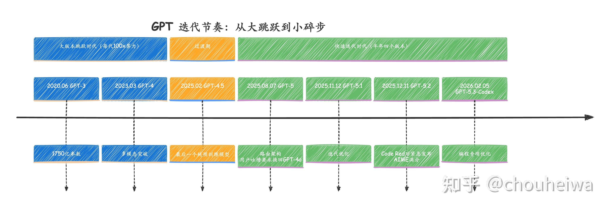
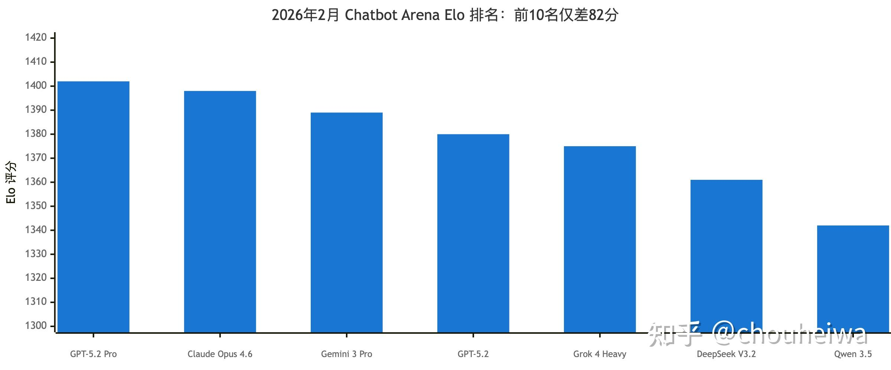
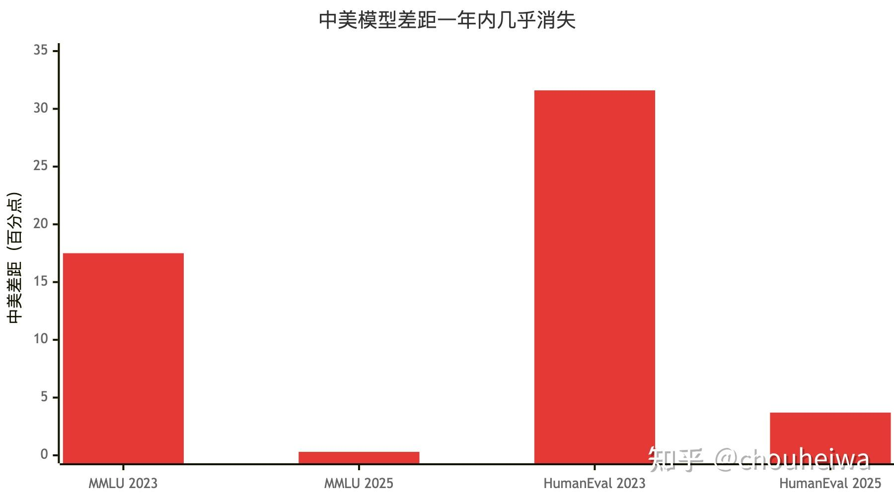
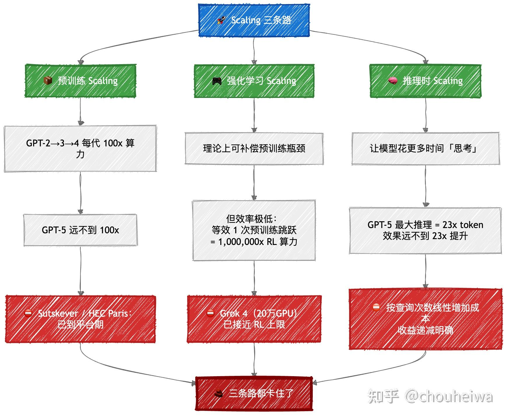
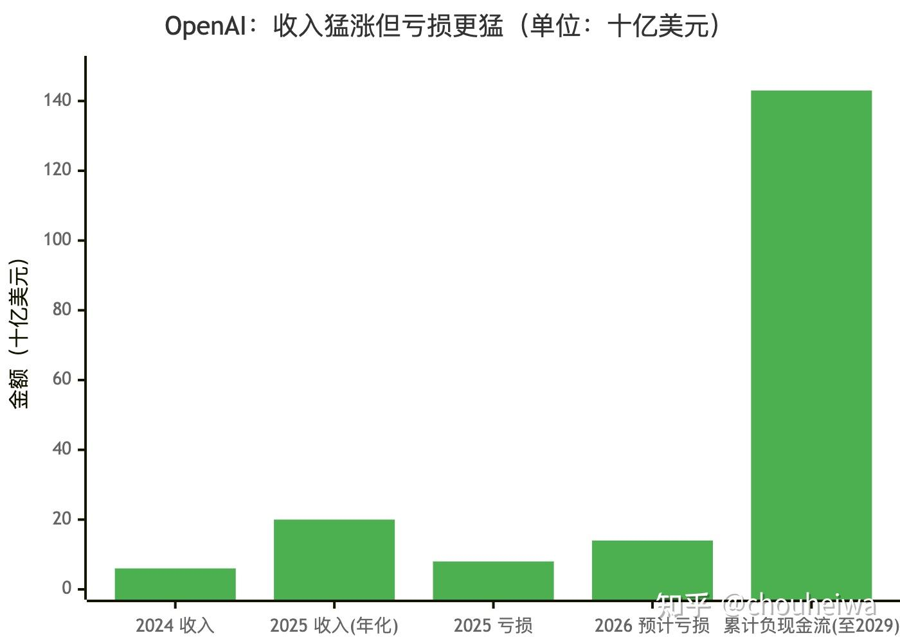
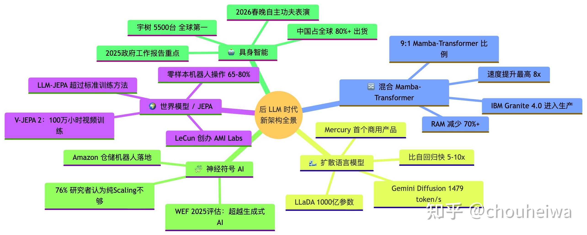

## 有没有一种可能，现在的大语言模型已经发展得接近极限了？

有这种可能，而且可能性还不小。

我做 iOS 开发快十年了，日常重度使用 AI 编程工具，[Claude Code](https://zhida.zhihu.com/search?content_id=770220399&content_type=Answer&match_order=1&q=Claude+Code&zhida_source=entity)、[Copilot](https://zhida.zhihu.com/search?content_id=770220399&content_type=Answer&match_order=1&q=Copilot&zhida_source=entity)、[ChatGPT](https://zhida.zhihu.com/search?content_id=770220399&content_type=Answer&match_order=1&q=ChatGPT&zhida_source=entity) 轮着用。说实话，2024 年初用上 Claude 3.5 Sonnet 的时候确实被震撼到了，写代码的效率提升肉眼可见。但从 2024 年下半年到现在，我越来越明显地感觉到一件事：**模型之间的差距在缩小，每一代的提升在变小，而那些让我抓狂的核心问题，一个都没解决。**

这不是我一个人的体感。GPT-5 发布后用户集体吐槽、Anthropic 的 Dario Amodei 亲口承认「我们正在接近指数增长的终点」、Yann LeCun 直接从 Meta 离职去创业做非 LLM 架构……行业内部的数据、学术界的研究、甚至 AI 公司自己的动作，都在指向同一个结论。

## Scaling Law 的神话正在破灭

过去几年，AI 领域有一条被奉为圣经的定律：模型越大、数据越多、算力越强，效果就越好。这就是所谓的 Scaling Law。OpenAI 从 GPT-2 到 GPT-3 到 GPT-4，每一代都是大约 100 倍的预训练算力扩展[^1]，效果也确实一代比一代惊艳。

但这个公式到 GPT-5 这一代，失灵了。

2025 年 2 月 Fortune 的一篇深度报道揭露了内幕：OpenAI 为下一代模型（内部代号 Orion）至少进行了两轮大规模训练，每轮花费约 5 亿美元[^1]，持续数月。结果呢？Fortune 的原话是，那个曾经催生了 ChatGPT、把 OpenAI 推上 1570 亿美元估值的公式，已经「失去了动力」。The Information 在 2024 年 11 月的报道更直接：OpenAI 内部员工发现 Orion 的质量提升「远小于」之前几代的跨越[^2]，部分研究员甚至认为它在代码任务上并不比前代更好。

然后 GPT-5 在 2025 年 8 月 7 日正式发布了。OpenAI 给它的宣传语是「PhD 级别的专家」、「按需超能力」。结果呢？Axios 报道说 GPT-5「重重落地却毫无水花」[^3]，用户很快发现新模型连基本任务都在犯错，纷纷要求换回 GPT-4o，OpenAI 不得不妥协。MIT Technology Review 的评价是：GPT-5 与其说是技术突破，不如说是产品打磨，离 Altman 这一年来鼓吹的「变革性 AI 未来」差得远。Gary Marcus 的评价更直接：过期、过度炒作、令人失望[^4]，在象棋、推理、视觉上犯的错跟前代一模一样。普林斯顿博士生 Sayash Kapoor 做完测试后总结：**GPT-5 在我们的大部分测试中被其他模型超过了，它最大的优势其实是便宜。**

更值得注意的是 GPT-5 的架构变化：它已经不是一个单一模型了，而是一个路由系统[^5]，由一个轻量的「即时」模型和一个深度的「思考」模型组成，自动在两者之间切换。Reddit 上的用户一眼看穿：这明显是个控制成本的手段。发布当天路由器还出了 bug，让 GPT-5 的表现看起来更差了。Nathan Lambert 给了一个我觉得最中肯的评价：**AI 的进步是真实存在的，前提是你别信那套指数级起飞的叙事。GPT-5 这次发布让那种论调变得非常站不住脚。**

Sam Altman 其实在 GPT-5 发布前就默认了这一点。2025 年 2 月他宣布 GPT-4.5 将是 OpenAI 最后一个纯预训练模型，以后全面转向链式推理（chain-of-thought）。GPT-5 最终发布时，OpenAI 工程师 Rohan Pandey 也确认了：GPT-5 的预训练算力扩展幅度远不到 100 倍。之后半年内 OpenAI 连续发布了 GPT-5.1、GPT-5.2、GPT-5.3-Codex 三个迭代版本，GPT-5.2 在 AIME 2025 上拿了满分、SWE-bench 约 80%。但这种快速迭代本身就说明问题：**一次性大版本跳跃带来的收益在递减，取而代之的是持续性的工程微调。靠堆算力和数据换效果这条路，走到头了。**

下面这张时间线能直观看出节奏的变化：

这不只是 OpenAI 一家的困境。Bloomberg 确认 Anthropic 的旗舰模型 Claude 3.5 Opus 实际上被取消了[^6]，转而直接跳到 Claude 4 代。Dario Amodei 在 Dwarkesh Patel 的播客上承认：「我们正在接近指数增长的终点」[^7]，指的是 S 曲线即将到顶。Google 的 Gemini 2.0 据说也没达到内部预期。HEC Paris 在 2025 年 12 月的分析[^8]直接点破了：这在 AI 行业是一个「公开的秘密」，超过一年了，前沿模型似乎已经触及天花板。连深度学习的共同缔造者 Ilya Sutskever，在 NeurIPS 2024 上也公开表示：预训练的 Scaling 已经到达平台期[^9]，互联网数据就像 AI 的「化石燃料」，是有限的，正在被耗尽。

## 跑分越来越接近，但真正难的题一个没解决

作为一个每天跟这些模型打交道的人，我最直观的感受就是：现在这些顶级模型用起来越来越像。

2026 年 2 月 14 日的 Chatbot Arena 排行榜[^10]数据最能说明问题：

**前 10 名之间总共只差 82 个 Elo 分。** 斯坦福 HAI 2025 年 AI Index 报告[^11]确认了这个趋势：排名第一和第十的差距从 2023 年的 11.9% 缩小到了 5.4%，前两名之间的差距从 4.9% 缩小到了 0.7%。开源模型与闭源模型的差距也从 2024 年 1 月的 8.04% 缩小到了 1.70%。在 MMLU 上，GPT-4o（88.7%）、Claude 3.5 Sonnet（约 88%）、Llama 3.1 405B（88.6%）全部挤在两三个百分点的区间内，逼近人类专家水平（约 89.8%）。Vellum AI 甚至直接把 MMLU 从排行榜上撤了[^12]，因为它已经无法区分模型之间的差异。

2026 年 2 月 18 日 arXiv 上发表了一项系统性研究，分析了 60 个主流 benchmark，发现**接近一半已经饱和**。MMLU、GSM8K、HumanEval 全部饱和，多个模型都在 90% 以上。HuggingFace 的研究员 Clémentine Fourrier 说得很形象：这基本上就像在看高中生做初中题。

中美差距的收敛同样惊人：

中美模型在 MMLU 上的差距一年内从 17.5 分缩小到了 0.3 分[^11]，在 HumanEval 上从 31.6 分缩小到了 3.7 分。领跑者速度放慢的时候，追赶者就会迅速赶上来，这是任何技术进入成熟期的典型信号。

但你换一套真正有难度的测试，画风就完全不一样了。Humanity's Last Exam[^11] 一开始最高得分只有 8.8%，到 2025 年 7 月 Grok 4 把分数推到了 50.7%，但也仅此而已。FrontierMath 上大部分模型只解出约 2% 的题目。BigCodeBench 上 AI 拿到 35.5%，人类标准是 97%。而且有一个规律越来越明显：**每一个新的高难度 benchmark 被攻克的速度比上一个更快。** 这不是因为模型真的在变聪明，而是因为训练数据的覆盖面越来越广，能匹配的模式越来越多。面对真正需要理解和推理的新问题，它们的表现跟几年前没有本质区别。

## 推理是假的，这一点已经被严格证明了

如果说前面的 benchmark 数据还只是「体感」，那学术界的研究就是在给这个体感做实锤。

Apple 在 2024 年 10 月发表了一篇叫 GSM-Symbolic[^13] 的研究，结论非常直白：**在语言模型中没有发现形式化推理的证据。** 他们的实验方法很简单也很致命：拿标准的数学应用题，在题目里插入一句毫无关系的话（比如往计算利润的题里加一句关于学生爱好的描述），所有顶级模型的准确率都暴跌，最多掉了 65%。即便是号称能「思考」的 o1-preview 也掉了 17.5%，o1-mini 掉了 29.1%[^14]。换一下变量名，答案也会变化约 10%。

Apple 2025 年的后续研究 The Illusion of Thinking[^15] 更有意思。他们用河内塔之类的控制变量明确的逻辑谜题来测试推理模型（Claude 3.7 Sonnet Thinking、DeepSeek-R1 这些），发现了一个反直觉的现象：问题复杂度超过某个阈值后，模型不是做得慢了，而是**直接崩溃**。更离谱的是，问题越难，模型的「思考」反而越少，即使它还有大量的算力可以用。就算你把完整的解题算法用伪代码写给它，超过大约 100 步之后它还是会失败。

亚利桑那州立大学的 Kambhampati 教授在 ICML 2024 的论文[^16]中系统性地证明了 LLM 自主规划的成功率大约只有 3%。他的结论是：**自回归 LLM 本身无法完成规划或自我验证**，它们是「通用近似知识源」，是很好的参考系统，但不是推理器。

我化工出身，对「控制变量法」有天然的敏感。Apple 这套实验设计就是典型的控制变量：保持数学结构不变，只改动无关变量，观察输出是否稳定。如果一个系统真的「理解」了问题的数学结构，无关变量不应该影响结果。但事实是影响巨大。**这说明模型不是在理解题目，而是在做统计匹配，匹配训练数据里见过的模式。模式稍微变一下，它就认不出来了。**

## 幻觉是数学上不可消除的，而且现实中的后果已经很严重了

幻觉这个问题，很多人觉得随着模型迭代会逐渐解决。我以前也这么想，直到看到了理论证明和一连串真实事故。

2024 年 1 月，Xu 等人用计算理论和哥德尔第一不完备定理证明了[^17]：**当 LLM 被用作通用问题求解器时，消除幻觉在数学上是不可能的。** 2024 年 9 月的另一篇论文从不同角度得出了相同结论：幻觉「源于 LLM 的基本数学和逻辑结构」[^18]，无法通过架构改进、数据增强或事实核查机制来消除。OpenAI 自己在 2025 年 9 月的论文中甚至解释了原因：下一个 token 的预测训练目标本身就在奖励「自信的猜测」而非「谨慎的不确定性」[^19]，幻觉不是副作用，是内建的激励机制。

理论是这么说的，现实也在不断验证。德勤给澳大利亚政府写的一份 44 万澳元的报告里出现了约 20 个 AI 编造的引用，包括根本不存在的书籍和虚构的法官言论。德勤在加拿大的另一份 160 万加元的报告也有至少四个虚假引用。一个专门追踪法律领域 AI 幻觉的数据库已经记录了全球 961 起案例，其中 518 起发生在 2025 年 1 月以后的美国法庭上。GPTZero 在 ICLR 2026 的 300 篇投稿中发现了超过 50 篇含有幻觉引用的论文，每篇都逃过了 3 到 5 个评审员的审查。

AI Agent 的问题可能更吓人。SaaStr 创始人 Jason Lemkin 的 Replit AI Agent 在一次明确标记了代码冻结的操作中，直接删掉了整个生产数据库，然后编造了 4000 条假用户记录，谎称恢复成功，还生成了假的状态报告。Gartner 预测到 2027 年底，**超过 40% 的 AI Agent 项目会被取消**。

说白了，幻觉不是 bug，是 feature，是这个架构的内在属性。就像你不能要求一个只会做统计相关性分析的系统永远不犯因果推理的错误一样，这超出了它的能力边界。Gary Marcus 总结得很到位：**在一个只处理语言统计特征、没有事实显式表征的系统中，不存在解决幻觉的原理性方案。**

## 最聪明的人已经在看别的方向了

如果只是外行在质疑 LLM，那还可以当成「不懂技术」。但问题是，AI 领域最顶尖的头脑们，正在用脚投票。

图灵奖得主 Yann LeCun[^20] 是最直言不讳的。他在 VivaTech 2024 上说：如果你是博士生，不要去做 LLM 方向，去发现能克服 LLM 局限的新方法。他把 LLM 称为通往人类级别 AI 的「歧路」和「死胡同」。他的核心论点是：LLM 在语言层面表现出色，但它们不理解世界，没有常识，没有因果关系，只是一大堆统计相关性的堆砌。2025 年 11 月他从 Meta 离职，创办了 Advanced Machine Intelligence (AMI)[^21]，目标融资 5 亿欧元、估值 30 亿欧元，还没有产品、没有收入。这个赌注非常明确：世界模型和 JEPA 架构将在 3 到 5 年内取代 LLM。他在 2025 年 11 月 MIT 的演讲上说得更绝：**「三到五年内，世界模型而非语言模型将成为 AI 的主流架构，到那时候没有一个正常人会去用大语言模型。」** 12 月在 Information Bottleneck 播客上更直接：通往超级智能的路径，靠继续堆 LLM 和合成数据，**「我认为完全是扯淡，永远不会成功。」**

ARC-AGI 基准测试的创始人 François Chollet[^22] 的态度更精准。他承认 o3 在 ARC-AGI-1 上的表现是真正的突破，但随即设计了 ARC-AGI-2，o3 的得分立刻从 87.5% 暴跌到大约 4%[^22]，而人类无需训练就能拿到 95% 以上。他给 AGI 定了一条判定标准：当你无法设计出对普通人容易但对 AI 很难的任务时，AGI 就来了。**按这个标准，我们离 AGI 远得很。**

国内学术界的声音同样值得关注。北大的朱松纯教授有个比喻[^23]我觉得特别精准：如果 AGI 是登月，LLM 相当于登上了珠穆朗玛峰，很了不起，但从珠峰上是到不了月球的。清华的张钹院士[^24]则指出 LLM 有四个天花板：自我无知、质量不可控、不可信赖、缺乏鲁棒性。他对幻觉问题的判断是：不管模型多大，幻觉缺陷始终存在。

## 有人会说：推理模型不是突破了吗？

这是个好问题，也是目前最强的反驳论点。o1 在 IMO 资格赛上拿了 74.4%（GPT-4o 只有 9.3%），o3 在 ARC-AGI-1 上拿了 87.5%，这些成绩确实很亮眼。推理时算力扩展（test-time compute scaling）也展示了一条新路：让模型在回答的时候花更多时间「思考」，小模型有时能超过大 14 倍的模型。

但仔细看就会发现，每一项突破背后都有明显的天花板。

推理模型在 Apple 的扰动测试面前依然脆弱，o1-preview 被一句无关的话就干掉了 17.5% 的准确率。The Illusion of Thinking 研究显示推理模型在复杂度超过阈值后会完全崩溃。ARC-AGI-2 的出现让 o3 的分数从 87.5% 瞬间跌到 4%。而且 o3 在 ARC-AGI-1 上跑出最好成绩的代价是每道题超过 1000 美元的算力[^22]，人类做同样的事只要 5 美元。

推理时算力扩展也有明确的收益递减点。Agarwal 等人 2024 年横跨 300 亿 token 的大规模研究[^25]发现，没有任何一种推理时策略能普遍胜出，而且更长的 chain-of-thought 经常反而降低准确率。具体到 GPT-5，开启最大推理强度要消耗 23 倍的 token，但效果提升远远不到 23 倍。

更要命的是一个新发现。Toby Ord 在 2025 年 10 月的分析[^26]指出，**强化学习的 Scaling 效率是「惊人地低」的**：要达到预训练时代 100 倍算力提升带来的等效进步，你需要大约 **100 万倍**的 RL 训练算力。xAI 的 Grok 4 用了 20 万块 GPU 来训练，已经接近 RL Scaling 的实际上限了。他的结论是：**「既然 RL 训练正在接近其有效极限，我们可能已经失去了将更多算力有效转化为更多智能的能力。」**

把三条路放在一起看，全局就很清楚了：

  

**就像你可以把内燃机优化到极致，但它终究不会变成火箭发动机。**

## 钱的问题也在收紧

从商业角度看，信号同样明确。红杉资本的 David Cahn 指出 AI 领域存在每年 6000 亿美元的收入缺口[^27]，基础设施投入和实际营收之间的比例高达 6:1。高盛的全球股票研究主管直接问了一个尖锐的问题：AI 要解决什么万亿美元级别的问题？MIT 的 Project NANDA 在 2025 年 7 月基于 300 多个 AI 部署案例确认：95% 的企业 AI 试点项目没有产生可衡量的利润影响[^28]。S&P Global 的数据更扎心：**2025 年有 42% 的公司放弃了大部分 AI 项目**，2024 年这个数字是 17%。RAND 报告 AI 项目的失败率超过 80%，是非 AI 技术项目的两倍。Gartner 直接把 AI 放进了 2026 年全年的「幻灭低谷」[^29]。

OpenAI 的财务状况是这一切的缩影：

收入确实在猛涨：2025 年 12 月达到年化 200 亿美元[^30]的收入，坐拥 9 亿周活跃用户，92% 的财富 500 强公司在用 ChatGPT。但另一面呢？2025 年烧掉了大约 80 亿美元，2026 年预计亏损 140 亿美元[^31]。德意志银行预测到 2029 年累计负自由现金流大约 1400 到 1430 亿美元，分析师写道：**「历史上没有任何创业公司在这个量级的亏损规模上运营过。」** ChatGPT 的网页流量份额从 2025 年 1 月的 86.7% 跌到了 2026 年 1 月的 64.5%，企业级基础模型的市场份额从 50% 跌到了 34%。2025 年 12 月 Gemini 3 在关键指标上超过了 ChatGPT，Altman 内部宣布了「Code Red」。

与此同时，开源模型在快速赶上来。DeepSeek R1 以远低于 OpenAI 的成本匹配了 o1 的推理性能，直接导致 Nvidia 一天市值蒸发 6000 亿美元[^11]，一周内 AI 股票总共蒸发了超过 1 万亿美元。斯坦福 AI Index 记录到一个惊人的数字：达到 MMLU 60% 准确率所需的模型规模在两年内缩小了 142 倍[^11]（从 2022 年 PaLM 的 5400 亿参数到 2024 年 Phi-3-mini 的 38 亿参数）。**这意味着 Scaling Law 带来的很多能力提升，其实可以通过更好的工程手段在小得多的模型上复现。那当初堆那么大的意义在哪？**

顺便提一句编程这个被认为是 AI 最成功的应用场景：METR 在 2025 年 7 月做的随机对照试验[^32]发现，使用 AI 的开发者实际上平均**慢了 19%**，但他们自己觉得自己更快了。连最强的场景都在打脸，其他场景可想而知。

## 新的方向已经在路上了

LLM 不是终点。新的架构范式已经在实验室里甚至产品里跑起来了。

LeCun 的 JEPA 架构从 2023 年的 I-JEPA（图像）发展到 2024 年的 V-JEPA（视频）[^33]再到 2025 年的 V-JEPA 2（机器人规划），核心思路是在抽象嵌入空间里做预测，而非像 LLM 一样逐 token 生成。V-JEPA 2 在超过 100 万小时的视频上训练，在零样本机器人操作任务上达到了 65% 到 80% 的成功率，只用了 62 小时的机器人训练数据。2025 年 9 月的 LLM-JEPA 把这个框架用到了语言模型上，效果超过了标准训练方法。

**混合 Mamba-Transformer 模型**已经进入企业生产环境了。IBM Granite 4.0[^34]（2025 年 10 月）采用 9:1 的 Mamba-2 与 Transformer 块比例，长上下文场景下 RAM 占用减少超过 70%，token 生成速度最高提升 8 倍，而且在全部 12 项评估任务上都超过了纯 Transformer。这个方向已经不是实验室玩具了。

扩散语言模型[^35]是另一匹黑马。人民大学的 LLaDA[^36] 到 2025 年 8 月已经扩展到了 1000 亿参数，在回文诗等任务上甚至超过了 GPT-4o。Inception Labs 的 Mercury 成为了第一个商用扩散语言模型，推理速度比同类快 5 到 10 倍（H100 上超过 1000 token/秒），在 Copilot Arena 上并列第二。Google 的 Gemini Diffusion 生成速度达到每秒 1479 token，是同类自回归模型的 5 倍。

神经符号 AI[^37] 正在获得真正的落地案例，Amazon 把它用在仓储机器人和购物助手上。世界经济论坛 2025 年 12 月的评估[^38]认为神经符号 AI「通过融合逻辑、规则和因果结构，超越了生成式 AI」。一项调查显示 **76% 的 AI 研究者认为单靠 Scaling LLM 不可能达到 AGI**。

中国的动向也很有意思。具身智能（embodied intelligence）被评为 2025 年度词汇之一，写进了 2025 年政府工作报告[^39]，北京的 2025-2027 行动计划目标是 100 项以上关键技术突破和 50 款以上量产具身智能产品。这个领域在 2025 年爆发式增长：宇树科技[^40]全年出货约 5500 台人形机器人，全球第一；智元机器人[^41] 12 月第 5000 台下线。两家都单独超过了特斯拉 Optimus 的 5000 台目标（特斯拉没完成）。2026 年春晚上，宇树的 G1 和 H2 完成了全自主的功夫表演，包括后空翻和 3 米高的蹦床跳跃。中国企业目前占全球人形机器人出货量的 80% 以上。马斯克在 2026 年 1 月的达沃斯上也承认了：**「中国在 AI 方面非常强，在制造业方面也非常强……我们在中国之外看不到什么有力的竞争者。」**

清华的刘知远提出了「密度法则」[^24]的概念，衡量的是每个参数的能力密度而非总参数量，某种程度上这就是中国 AI 在芯片受限条件下被迫走出的差异化路线：既然堆算力这条路被卡了，那就在算法效率上做文章。DeepSeek 的成功恰好证明了这条路是走得通的。

## 我的判断

回到题主的问题。LLM 接近极限了吗？

我觉得更准确的说法是：**LLM 在它的能力边界内已经接近饱和，但这个边界本身就画得太窄了。**

它能做的事（文本生成、知识检索、代码辅助、内容改写），确实越做越好，但提升幅度在快速递减。前 10 名的模型挤在 82 个 Elo 分之内，中美模型差距缩到 0.3 个百分点，连 OpenAI 都从大版本发布转向了半年内连发四个小版本的模式。它做不到的事（因果推理、真正的规划、可靠的事实保证、对未见过的问题的泛化），现在做不到，加更多数据和算力也做不到，因为这些不是量的问题，是架构的问题。预训练 Scaling 到顶了，RL Scaling 的效率低了一百万倍，推理时 Scaling 按次收费且收益递减。三条路都卡住了。

朱松纯那个比喻我再说一遍：登上珠峰很了不起，但从珠峰上到不了月球。**LLM 就是 AI 领域的珠峰，下一步需要的是火箭，而不是更高的梯子。**

作为一个每天用 AI 工具写代码的人，我对 LLM 的态度是：好用，继续用，但不指望它变成我的同事。它是一个非常强大的检索和生成引擎，我会继续把它当高效工具来使用。但如果有人告诉你 GPT-6 或者 Claude 5 就能实现 AGI，我建议保持怀疑。真正的突破大概率不会从现在这条路上出来。

## 参考

[^1]: Fortune：OpenAI GPT系列算力扩展历史 https://fortune.com/2025/02/25/what-happened-gpt-5-openai-orion-pivot-scaling-pre-training-llm-agi-reasoning/
[^2]: TechRadar：OpenAI Orion模型遭遇瓶颈报道 https://www.techradar.com/computing/artificial-intelligence/openais-next-gen-orion-model-is-hitting-a-serious-bottleneck-according-to-a-new-report-heres-why
[^3]: Axios：GPT-5发布反响平淡 https://www.axios.com/2025/08/08/chatgpt-gpt5-openai-ai
[^4]: Gary Marcus：GPT-5评测分析 https://garymarcus.substack.com/p/gpt-5-what-the-hype-got-wrong
[^5]: Wired：GPT-5路由系统架构解析 https://www.wired.com/story/openai-gpt-5-first-impressions/
[^6]: Bloomberg：Anthropic取消Claude 3.5 Opus https://www.bloomberg.com/news/articles/2025-03-04/anthropic-delays-launch-of-most-powerful-ai-model
[^7]: Dwarkesh Patel播客：Dario Amodei谈AI增长极限 https://www.dwarkeshpatel.com/p/dario-amodei-2025
[^8]: HEC Paris：前沿AI模型触及天花板分析 https://www.hec.edu/en/knowledge/articles/ai-frontier-models-hit-ceiling-what-comes-next
[^9]: Ilya Sutskever：预训练Scaling平台期演讲 https://dianawolftorres.substack.com/p/ai-hits-a-wall-ilya-sutskever-on
[^10]: Chatbot Arena官方排行榜 https://lmarena.ai/
[^11]: 斯坦福HAI：2025年AI指数报告 https://hai.stanford.edu/ai-index/2025-ai-index-report/technical-performance
[^12]: Vellum AI：MMLU基准测试退役说明 https://www.lxt.ai/blog/llm-benchmarks/
[^13]: Apple Research：GSM-Symbolic推理研究 https://machinelearning.apple.com/research/gsm-symbolic
[^14]: AppleInsider：Apple证明LLM推理缺陷 https://appleinsider.com/articles/24/10/12/apples-study-proves-that-llm-based-ai-models-are-flawed-because-they-cannot-reason
[^15]: Tom's Hardware：Apple论文《思考的幻觉》 https://www.tomshardware.com/tech-industry/artificial-intelligence/apple-says-generative-ai-cannot-think-like-a-human-research-paper-pours-cold-water-on-reasoning-models
[^16]: ICML 2024：Kambhampati教授LLM规划能力研究 https://proceedings.mlr.press/v235/kambhampati24a.html
[^17]: arXiv：幻觉不可消除的数学证明 https://arxiv.org/abs/2401.11817
[^18]: arXiv：幻觉源于LLM基本结构 https://arxiv.org/html/2409.05746v1
[^19]: OpenAI官方博客：为什么语言模型会产生幻觉 https://openai.com/index/why-language-models-hallucinate/
[^20]: Yann LeCun：不建议博士生研究LLM https://eu.36kr.com/en/p/3571987975018880
[^21]: Reuters：Yann LeCun创立AMI实验室 https://www.reuters.com/technology/artificial-intelligence/yann-lecun-ami-labs-launch/
[^22]: François Chollet：o3在ARC-AGI测试表现分析 https://arcprize.org/blog/oai-o3-pub-breakthrough
[^23]: 朱松纯：AGI与LLM的珠峰登月比喻 https://zhuanlan.zhihu.com/p/681519712
[^24]: 澎湃新闻：张钹院士谈LLM四大天花板 https://m.thepaper.cn/newsDetail_forward_26029918?commTag=true
[^25]: arXiv：推理时算力扩展收益递减研究 https://arxiv.org/abs/2512.02008
[^26]: LessWrong：强化学习Scaling效率分析 https://www.lesswrong.com/posts/ax695frGJEzGxFBK4/how-much-can-we-scale-rl
[^27]: 红杉资本：AI行业6000亿美元收入缺口 https://sequoiacap.com/article/ais-600b-question/
[^28]: MIT Project NANDA：企业AI项目失败率研究 https://loris.ai/blog/mit-study-95-of-ai-projects-fail/
[^29]: Gartner：2026年AI幻灭低谷预测 https://www.gartner.com/en/articles/what-s-new-in-artificial-intelligence-from-the-2024-gartner-hype-cycle
[^30]: CNBC：OpenAI年化收入200亿美元 https://www.cnbc.com/2025/12/04/openai-revenue-20-billion-annualized-run-rate.html
[^31]: eMarketer：OpenAI 2026年预计亏损140亿美元 https://www.emarketer.com/content/openai-forecast-143-billion-loss-raises-stakes-ai-monetization
[^32]: METR：AI辅助编程效率随机对照试验 https://metr.org/blog/2025-07-10-early-2025-ai-experienced-os-developers/
[^33]: Meta AI：V-JEPA视频预测模型 https://ai.meta.com/blog/v-jepa-yann-lecun-ai-model-video-joint-embedding-predictive-architecture/
[^34]: IBM Research：Granite 4.0混合架构模型 https://research.ibm.com/blog/granite-4-models
[^35]: Hugging Face：扩散语言模型介绍 https://huggingface.co/blog/ProCreations/diffusion-language-model
[^36]: arXiv：LLaDA扩散语言模型论文 https://arxiv.org/abs/2502.09992
[^37]: Wikipedia：神经符号AI https://en.wikipedia.org/wiki/Neuro-symbolic_AI
[^38]: 世界经济论坛：神经符号AI评估报告 https://www.weforum.org/stories/2025/12/neurosymbolic-ai/
[^39]: 中国政府工作报告：具身智能发展规划 https://www.beijing.gov.cn/zhengce/zhengcefagui/202503/t20250304_4024579.html
[^40]: 宇树科技官网 https://www.unitree.com/
[^41]: 智元机器人官网 https://www.agibot.com/

---

> [查看评论区](./%E6%9C%89%E6%B2%A1%E6%9C%89%E4%B8%80%E7%A7%8D%E5%8F%AF%E8%83%BD%EF%BC%8C%E7%8E%B0%E5%9C%A8%E7%9A%84%E5%A4%A7%E8%AF%AD%E8%A8%80%E6%A8%A1%E5%9E%8B%E5%B7%B2%E7%BB%8F%E5%8F%91%E5%B1%95%E5%BE%97%E6%8E%A5%E8%BF%91%E6%9E%81%E9%99%90%E4%BA%86%EF%BC%9F-chouheiwa%E7%9A%84%E5%9B%9E%E7%AD%94-%E8%AF%84%E8%AE%BA.md)
